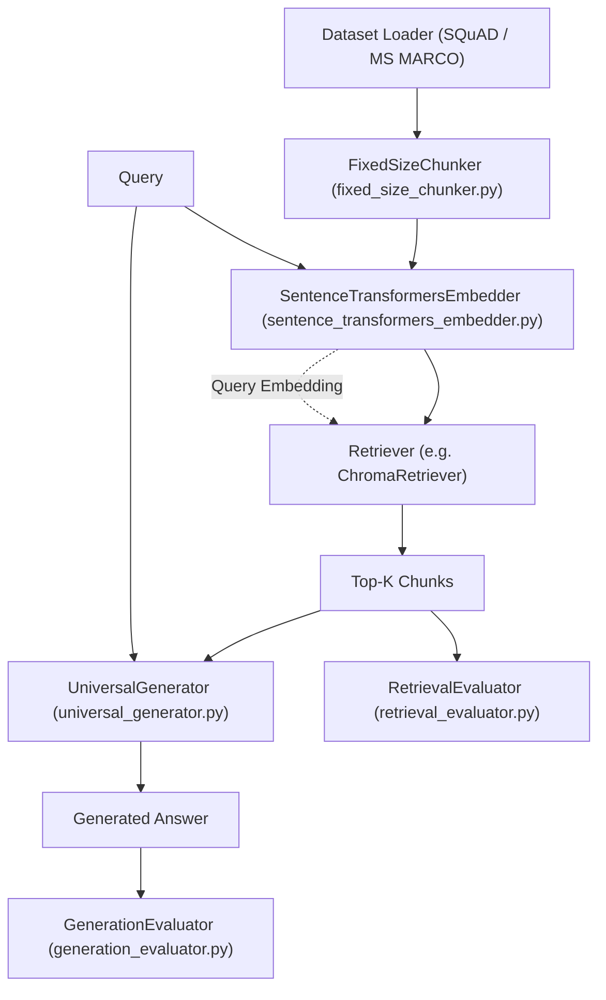
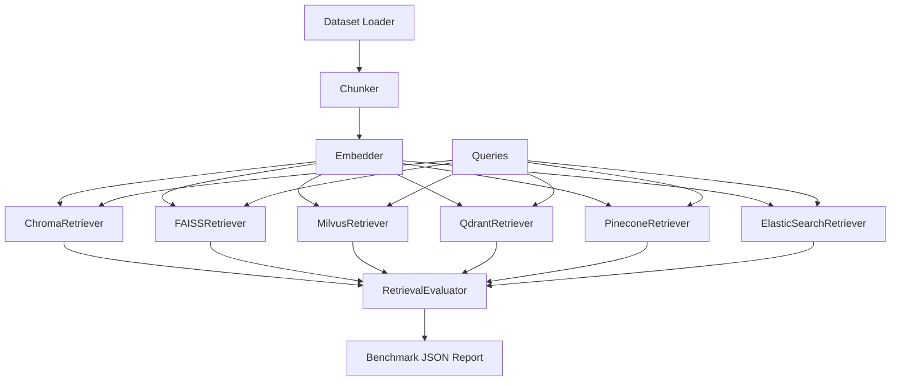
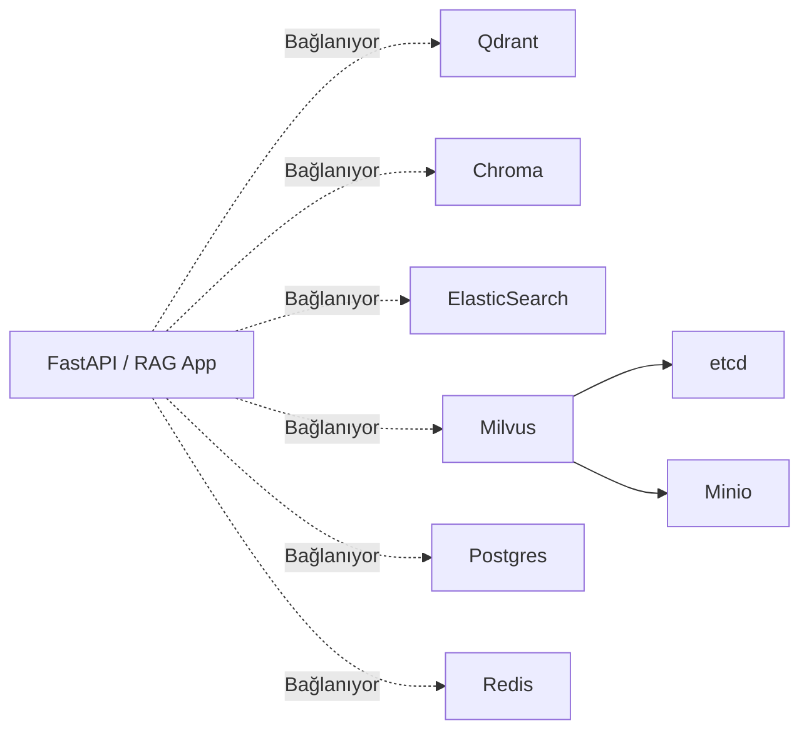

# RAG Vector DB Benchmark Mimari Dokümanı

Bu doküman, sistemin genel mimarisini, bileşenlerini ve veri akışını detaylandırmak amacıyla hazırlanmıştır. Projenin amacı, RAG (Retrieval-Augmented Generation) sistemlerinde kullanılan farklı vektör veritabanlarının ve LLM bileşenlerinin izole olarak, adil ve tekrarlanabilir bir şekilde test edilebilmesini sağlayan modüler bir framework sunmaktır.

Proje, temelde **Retrieval** (Bilgi Getirme) ve **Generation** (Üretim) aşamalarını birbirinden kesin sınırlarla ayırır. Böylece, düşük başarımın veri bulamamaktan mı (Retriever hatası) yoksa bulunan veriyi yorumlayamamaktan mı (Generator hatası) kaynaklandığı net bir şekilde ölçülebilir. Çeşitli veritabanları (Chroma, Qdrant, FAISS, Milvus, Pinecone, ElasticSearch) aynı soyut arayüzü uyguladıkları için tek bir konfigürasyon değişikliğiyle birbirleri yerine kullanılabilir ve performansları (gecikme, isabetlilik) doğrudan karşılaştırılabilir.

---

## 1. Katmanlı Mimari ve Veri Akışı

Sistem, iki temel çalıştırma senaryosuna sahiptir: biri uçtan uca tüm RAG pipeline'ını (üretim dahil) çalıştıran deneyler, diğeri ise sadece vektör veritabanlarının indeksleme ve geri getirme hızlarını/isabet oranlarını karşılaştıran salt retrieval kıyaslaması.

### A. Uçtan Uca RAG Akışı (`run_experiment.py`)
Bu akışta, dokümanlar sisteme beslenir, parçalara ayrılır (Chunker), vektörlere dönüştürülür (Embedder) ve vektör veritabanına kaydedilir (Retriever). Daha sonra, her bir soru (Query) için bağlam (Context) aranır ve üretici modele (Generator) gönderilir. Hem retrieval başarısı hem de cevap kalitesi (Evaluators) değerlendirilir.

### B. Çoklu DB Karşılaştırma Akışı (`benchmark_db.py`)
Bu akış, üretim (Generation) aşamasını atlar ve yalnızca birden fazla vektör veritabanının bilgi getirme (Retrieval) başarısına odaklanır. Farklı veritabanları aynı metrikler (MRR, Precision@K vb.) ve aynı sorgularla art arda test edilir.

---

## 2. Retriever Soyutlaması

Tüm vektör veritabanı entegrasyonları `src/core/retrieval.py` içinde tanımlanan `Retriever` ABC'sini (Abstract Base Class) miras alır ve şu 4 metodu uygulamak zorundadır:
- `add_chunks(chunks, embeddings)`
- `retrieve(query, top_k)`
- `retrieve_with_embedding(query_embedding, top_k, query_id)`
- `clear()`

Aşağıdaki tablo, uygulanan somut retriever'ların özelliklerini gösterir:

| Veritabanı | Bağlantı Modu | Varsayılan Mesafe (Distance) | İndeks Tipi |
|---|---|---|---|
| **ChromaDB** | In-memory / Persistent | Cosine | HNSW |
| **Qdrant** | In-memory / Server | Cosine | HNSW |
| **FAISS** | In-memory | Inner Product / L2 | Flat (IndexFlatIP) |
| **Milvus** | Server (Standalone) | Cosine / IP | HNSW / Flat |
| **Pinecone** | Cloud / Serverless | Cosine | Özel (Proprietary HNSW) |
| **ElasticSearch** | Server | Cosine | HNSW (Dense Vector) |

---

## 3. Konfigürasyon Akışı

Projenin bağımlılık enjeksiyonu (dependency injection) ve bileşen oluşturma (instantiation) işlemleri tamamen konfigürasyon güdümlüdür. Kod içinde hardcode edilmiş hiçbir model adı veya sunucu URL'i bulunmaz.

1. **YAML'dan Okuma:** `experiments/configs/*.yaml` dosyaları `src/utils/config_loader.py` tarafından okunur.
2. **Dataclass Dönüşümü:** Okunan dict verisi; `ChromaRetrieverConfig`, `UniversalGeneratorConfig` gibi `%sConfig` `@dataclass(frozen=True)` yapılarına çevrilir.
3. **Farklı Tüketim Stilleri:**
   - `run_experiment.py`: Bütün konfigürasyonu doğrudan YAML'dan okur. Hangi veritabanının ve üreticinin kullanılacağı tek bir YAML dosyasıyla bellidir.
   - `benchmark_db.py`: Çoklu DB karşılaştırması yaptığı için doküman/sorgu sayısı (`--num-documents`, `--num-queries`) gibi temel parametreleri doğrudan CLI üzerinden (argparse ile) kabul eder. Böylece aynı YAML dosyasını farklı ölçeklerde test etmek mümkün olur.

---

## 4. Docker ve Dağıtım Mimarisi

Dış bağımlılık (server tabanlı veritabanları ve servisler) gerektiren bileşenler `docker-compose.yml` üzerinden yapılandırılmıştır.

_Not: Milvus servisi, çalışmaya başlamadan önce kendi bağımlılıkları olan `etcd` ve `minio` servislerinin `healthy` durumuna gelmesini bekler._

---

## 5. Değerlendirme Metrikleri

Sistem, değerlendirme için iki ayrı izole modül kullanır.

### RetrievalEvaluator (`src/evaluators/retrieval_evaluator.py`)
Gelen bağlamın (context) hedeflenen gerçek bağlamı (ground truth) içerip içermediğine bakar:
- **Precision@K:** Döndürülen ilk K sonucun ne kadarının doğru yanıtla örtüştüğünü gösterir.
- **Recall@K:** Doğru yanıtların (eğer birden fazlaysa) ne kadarının ilk K sonucun içinde yer aldığını gösterir.
- **MRR (Mean Reciprocal Rank):** İlk doğru sonucun kaçıncı sırada geldiğinin (1/sıra) ortalamasını hesaplar.
- **nDCG (Normalized Discounted Cumulative Gain):** Doğru sonuçların üst sıralarda gelmesini ödüllendiren, sıraya duyarlı bir başarı metriğidir.

### GenerationEvaluator (`src/evaluators/generation_evaluator.py`)
Bir LLM'i "hakem" (LLM-as-a-judge) olarak kullanarak üretilen cevabı inceler:
- **Faithfulness (Sadakat):** Modelin halüsinasyon görüp görmediğini ölçer; cevabın, sadece ve tamamen sağlanan bağlama (context) dayalı olup olmadığını (0-10) değerlendirir.
- **Relevancy (Alaka):** Üretilen cevabın, kullanıcının sorduğu soruyla ne kadar doğrudan ilgili ve yeterli olduğunu (0-10) değerlendirir.

---

## 6. Bilinen Sınırlamalar (Known Limitations)

- Veri katmanı iki modda çalışır: SQuAD answer-quality deneyleri ve MS MARCO passage retrieval
  deneyleri. MS MARCO tarafında gold eşleşme qrels üzerinden yapılır; SQuAD tarafında cevap
  metinleri üzerinden değerlendirme yapılır.
- Test kapsamı ElasticSearch için sınırlıdır, özellikle auth gerektiren cloud versiyonları test edilmemiştir.
- GenerationEvaluator, hakem modeli (judge) olarak kullanılan LLM'in performansına bağımlıdır (küçük yerel modeller yanıltıcı metrikler üretebilir).
