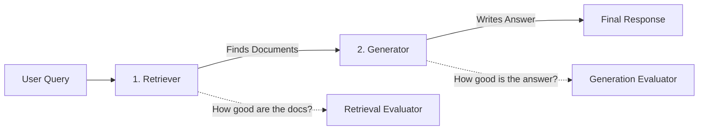

# RAG Vector DB Benchmark

[](https://github.com/nnadir35/rag-vector-db-benchmark/actions/workflows/ci.yml)
[](https://www.python.org/downloads/release/python-3100/)
[](http://mypy-lang.org/)
[](https://github.com/astral-sh/ruff)

> 🚀 **[Quick Start: Explore the Interactive Demo Notebook here (`notebooks/example_evaluation.ipynb`)](notebooks/example_evaluation.ipynb)**
> **Let your business ask questions to its own data — and measure exactly how well it works.**

This framework benchmarks end-to-end RAG (Retrieval-Augmented Generation) pipelines: how accurately an AI system retrieves relevant documents and generates correct answers from a company's internal knowledge base.

## Historical Benchmark Results (SQuAD v2 · 100 queries, top_k=10, real Docker services)

Retrieval quality (MRR / nDCG / Recall) is **identical across all 6 databases** at
this scale — with ~100 documents every DB does an effectively-exact nearest-neighbor
search, so quality differences don't show up yet (they emerge at larger scale once
approximate indexing kicks in, see below). What differs is speed:

| DB | MRR | nDCG@10 | Recall@10 | Retrieval latency |
| --- | --- | --- | --- | --- |
| FAISS | 0.7335 | 0.7827 | 0.93 | **18 ms** |
| ElasticSearch | 0.7335 | 0.7827 | 0.93 | 25 ms |
| Milvus | 0.7335 | 0.7827 | 0.93 | 30 ms |
| ChromaDB | 0.7335 | 0.7827 | 0.93 | 32 ms |
| Qdrant | 0.7335 | 0.7827 | 0.93 | 32 ms |
| Weaviate | 0.7335 | 0.7827 | 0.93 | 54 ms |

*Quality metrics (MRR/nDCG/Recall) from `experiments/results/official_baseline_<db>_100q_topk10_*.json`
(100 queries against the SQuAD v2 validation split). Latency figures from the ~100-document
scale run `experiments/results/official_scale_100docs_6db_GPU_realserver_20260716_150826.json`
— a separate run at comparable scale, since the baseline files don't record per-query timing.
The current systematic benchmark configuration uses MS MARCO passage via local TSV / TSV.GZ
files; see `experiments/configs/benchmark_all_dbs.yaml` for the live dataset settings.*

### At 1000 documents

| DB | Retrieval latency | Recall@10 |
| --- | --- | --- |
| Weaviate | 17 ms | 0.83 |
| FAISS | 17 ms | 0.83 |
| Milvus | 18 ms | 0.83 |
| ElasticSearch | 23 ms | 0.83 |
| ChromaDB | 28 ms | 0.83 |
| Qdrant | 32 ms | 0.83 |

*Source: `experiments/results/official_scale_1000docs_6db_GPU_realserver_20260716_151645.json`.
Milvus here is the real Docker server, not Milvus Lite — its earlier ~340 ms-class numbers
in older runs came from `in_memory: true` (embedded Milvus Lite), not the production engine;
see [`in_memory` semantics](#retrieverin_memory--read-this-before-comparing-dbs) below.*

## What This Enables

- **Drop in any LLM**: Ollama (local/private), OpenAI, Anthropic — swap with one config change
- **6 vector DBs benchmarked**: ChromaDB, Qdrant, FAISS, Milvus, ElasticSearch, Weaviate. A
  Pinecone adapter also exists (`src/retrievers/pinecone_retriever.py`) but is **not** part of
  the systematic benchmark — it's managed-only SaaS and can't be run against local Docker like
  the others.
- **Two dataset modes**: SQuAD is kept for historical answer-quality experiments, while the
  current retrieval benchmark runs on MS MARCO passage loaded from local `collection.tsv`,
  `queries.dev.small.tsv`, and `qrels.dev.small.tsv` files with streaming readers.
- **Measure before you ship**: Know your retrieval quality with real numbers before going to production
- **Full privacy option**: Runs entirely locally with Ollama — no data leaves your servers

## Stack

Python · ChromaDB · Ollama/llama3 · sentence-transformers · FastAPI · Gradio · LiteLLM

---

> **Repository Structure**: See [STRUCTURE.md](./STRUCTURE.md) for a detailed breakdown of the directory organization, component responsibilities, and design principles.

## Installation

From the repository root:

```bash
python -m venv .venv
source .venv/bin/activate   # Windows: .venv\Scripts\activate
pip install -r requirements.txt
```

`requirements.txt` covers ChromaDB, Qdrant, Milvus, and FAISS. ElasticSearch and Weaviate
clients aren't pinned there yet — install them separately if you're running against the real
servers (`in_memory: false`):

```bash
pip install elasticsearch "weaviate-client>=4.0.0"
```

To benchmark against the real Docker-backed services instead of the in-process mocks/Lite
modes, start them first:

```bash
docker-compose up -d
```

Run benchmarks and tests from the same directory (scripts add the project root to `sys.path`).
Setting `HF_HUB_OFFLINE=1` is recommended once the embedding model has been downloaded once —
it stops `sentence-transformers` from making a Hub network call on every run:

```bash
HF_HUB_OFFLINE=1 python scripts/run_experiment.py --config experiments/configs/baseline_ollama.yaml
python -m pytest tests/ -q
python api.py   # FastAPI on http://0.0.0.0:8000  (requires Ollama if using default generator)
```

## Configuration

Baseline experiment configs live in `experiments/configs/`, one per retriever plus a
combined run:

| Config | Purpose |
| --- | --- |
| `baseline_chroma.yaml` | ChromaDB retriever (historical / deprecated — SQuAD v2, bkz. DENEY-PLANI-V2.md Faz 1) |
| `baseline_qdrant.yaml` | Qdrant retriever (historical / deprecated — SQuAD v2, bkz. DENEY-PLANI-V2.md Faz 1) |
| `baseline_faiss.yaml` | FAISS retriever (historical / deprecated — SQuAD v2, bkz. DENEY-PLANI-V2.md Faz 1) |
| `baseline_milvus.yaml` | Milvus retriever (historical / deprecated — SQuAD v2, bkz. DENEY-PLANI-V2.md Faz 1) |
| `baseline_elasticsearch.yaml` | ElasticSearch retriever (historical / deprecated — SQuAD v2, bkz. DENEY-PLANI-V2.md Faz 1) |
| `baseline_weaviate.yaml` | Weaviate retriever (historical / deprecated — SQuAD v2, bkz. DENEY-PLANI-V2.md Faz 1) |
| `baseline_ollama.yaml` | End-to-end run with the Ollama generator |
| `benchmark_all_dbs.yaml` | Runs all 6 retrievers on MS MARCO passage via local TSV inputs |
| `docker_rag_api.yaml` | Config used by the Dockerized `api.py` service |

### `retriever.in_memory` — read this before comparing DBs

Every retriever config accepts an `in_memory` flag, but **it means something different
for each database** — it is not a uniform "no Docker" switch:

| DB | `in_memory: true` | `in_memory: false` |
| --- | --- | --- |
| ChromaDB | *(no such option — always a real client)* | always a real client |
| FAISS | *(no such option — always in-process)* | always in-process |
| Qdrant | Full Qdrant engine, RAM-only, nothing written to disk | Connects to the Dockerized Qdrant service |
| Milvus | **Milvus Lite** — an embedded, single-process build; ~10x slower than the real server and not representative of production Milvus | Connects to the real Milvus server (Docker) |
| ElasticSearch | **Mock**: a plain dict + NumPy cosine similarity — none of the real Elasticsearch client/index code runs | Connects to the real ES server (Docker, port 9200) |
| Weaviate | **Mock**: same dict + NumPy cosine similarity mock as ES — none of the real Weaviate client code runs | Connects to the real Weaviate server (Docker, port 8080) |

This matters for benchmarking: a Milvus/ElasticSearch/Weaviate run with `in_memory: true`
is **not** measuring the real database — it's measuring an embedded or mocked stand-in. All
`official_*` results above were produced with the real services (`in_memory: false`, or
Qdrant's genuine RAM-only engine, which is a real implementation rather than a mock).

Test suites intentionally use `in_memory: true` everywhere (fast, no Docker dependency) —
see `tests/conftest.py`.

### Embedding device

`embedder.device` accepts `"cpu"`, `"cuda"` (NVIDIA GPU), or `"mps"` (Apple Silicon GPU).
The bundled baseline configs default to `"mps"`; switch to `"cpu"` on machines without a
compatible GPU, or `"cuda"` on NVIDIA hardware.

### Scope note

This framework is used in the author's thesis with a **retrieval-focused** lens: the DB
comparisons above rank databases on retrieval metrics only. The framework also implements
LLM-judge generation evaluation (Faithfulness, Relevance — see `src/evaluators/generation_evaluator.py`)
for full end-to-end runs, but that's orthogonal to vector-DB choice — generation quality is
driven by the LLM and prompt, not the retriever — so it's left out of the DB comparison
tables.

## Problem Definition

RAG systems combine information retrieval with language generation, creating complex interactions between retrieval components (vector databases, embedding models) and generation components (LLMs, prompt engineering). Current evaluation practices often conflate these concerns, making it difficult to:

- **Isolate performance bottlenecks**: Understand whether poor results stem from retrieval failures or generation limitations
- **Compare vector databases fairly**: Evaluate retrieval systems independently of downstream generation choices
- **Reproduce experiments**: Ensure consistent, deterministic evaluation across different environments
- **Scale evaluations**: Systematically test combinations of retrievers, generators, and configurations

This framework addresses these challenges by enforcing strict separation of concerns and providing a reproducible, configurable evaluation infrastructure.

## What is Benchmarked

### In Scope

**Retrieval Components**
- Vector database query performance (latency, throughput)
- Embedding model effectiveness (retrieval accuracy, semantic similarity)
- Retrieval quality metrics (precision, recall, nDCG, MRR)
- Retrieval latency and cost per query

**Generation Components**
- LLM response quality (faithfulness, relevance, answer quality)
- Generation latency and cost per response
- Prompt engineering effectiveness

**End-to-End Pipeline**
- Overall system accuracy and quality
- Total latency (retrieval + generation)
- Total cost per query
- Failure modes and error analysis

### Out of Scope

- **Model training or fine-tuning**: This framework evaluates existing models, not training new ones
- **Data preprocessing pipelines**: Assumes pre-processed, chunked documents are available
- **Production deployment concerns**: Focuses on evaluation, not serving infrastructure
- **Real-time monitoring**: Designed for batch evaluation, not continuous monitoring
- **User experience metrics**: Focuses on technical metrics, not subjective user satisfaction

## RAG Pipeline Overview

Think of the RAG system as a team of three specialists working together to answer a question. This framework keeps them strictly separated so you can measure exactly who is doing a good job and who is failing.



### 🧩 The Three Specialists (Components)

**1. The Librarian (Retriever)**
- **What it does:** Takes your question and searches the database for relevant text chunks.
- **What it contains:** The Vector Database (ChromaDB, Qdrant, FAISS, Milvus, ElasticSearch, or Weaviate) and the Embedding Model.
- **How it's graded:** Did it find the right documents? (Metrics: MRR, Precision, Recall)

**2. The Writer (Generator)**
- **What it does:** Reads the documents found by the Librarian and writes a coherent answer to your question.
- **What it contains:** The LLM (like GPT-4 or Llama 3) and the Prompt Template.
- **How it's graded:** Is the answer based *only* on the documents? Is it helpful? (LLM-judge metrics: Faithfulness, Relevance) — plus reference-based **Exact Match (EM)** and **F1** against the SQuAD gold answers (`AnswerQualityEvaluator`), which don't require an LLM judge at all.

**3. The Judge (Evaluator)**
- **What it does:** Gives a score to the Librarian and the Writer separately.
- **Why it matters:** If the final answer is wrong, the Judge tells you if it's because the Librarian didn't find the right document, or because the Writer misunderstood the document.

### 📐 Core Design Principles

- **Plug-and-Play:** You can swap the Librarian (e.g., Pinecone to FAISS) or the Writer (e.g., OpenAI to local Ollama) by changing just one line in a configuration file.
- **Total Isolation:** The Librarian doesn't know the Writer exists. This guarantees our tests are fair and unbiased.
- **No Hardcoding:** Every single parameter (model name, chunk size, temperature) is controlled via config files.

## Evaluation Philosophy

### Reproducibility First

All experiments must be reproducible. This means:
- Deterministic evaluation where possible (fixed seeds, consistent data splits)
- Versioned configurations for all components
- Immutable experiment artifacts (inputs, outputs, metrics)
- Clear documentation of non-deterministic sources

### Isolated Component Evaluation

**Retrieval evaluation** measures:
- How well the retriever finds relevant documents
- Query performance characteristics (latency, cost)
- Independent of downstream generation quality

**Generation evaluation** measures:
- How well the generator produces accurate, relevant responses
- Response quality given fixed retrieval results
- Independent of retrieval system choices

**Combined evaluation** measures:
- End-to-end system performance
- Interaction effects between components
- Total system cost and latency

### Metrics Hierarchy

1. **Primary metrics**: Core quality measures (Exact Match, F1, relevance, faithfulness)
2. **Performance metrics**: Latency and throughput
3. **Cost metrics**: Per-query and per-experiment costs
4. **Failure analysis**: Error rates, timeout frequencies, edge case handling

### Evaluation Workflow

1. **Baseline establishment**: Evaluate each component independently
2. **Component optimization**: Iterate on individual components
3. **Integration testing**: Evaluate component combinations
4. **Comparative analysis**: Compare configurations systematically

## Experiment-Driven Workflow

The framework supports a systematic, experiment-driven approach to RAG system development:

### Experiment Definition

An experiment consists of:
- **Configuration**: Component choices (retriever, generator, evaluators)
- **Dataset**: Query set and ground truth
- **Metrics**: Evaluation criteria and success thresholds
- **Constraints**: Resource limits, timeout values

### Experiment Execution

1. **Configuration loading**: Load experiment configuration from files
2. **Component instantiation**: Create retriever, generator, and evaluator instances
3. **Pipeline execution**: Run queries through the RAG pipeline
4. **Metric collection**: Gather performance, quality, and cost metrics
5. **Result aggregation**: Combine metrics across queries and components

### Experiment Analysis

- **Component-level analysis**: Identify which components drive performance
- **Ablation studies**: Understand contribution of each component
- **Cost-performance tradeoffs**: Analyze efficiency vs. quality curves
- **Failure mode analysis**: Identify systematic weaknesses

### Experiment Reproducibility

- All experiments are defined declaratively (no code changes needed)
- Experiment results are versioned and immutable
- Comparison across experiments is standardized
- Historical experiment data supports longitudinal analysis

## How to Extend the Framework

### Adding a New Retriever

1. **Implement the retriever interface**: Define how your retriever accepts queries and returns results
2. **Encapsulate configuration**: Make all retriever-specific settings configurable
3. **Register the retriever**: Add to the retriever registry with a unique identifier
4. **No generator knowledge**: Retriever implementation must not depend on generator details

### Adding a New Generator

1. **Implement the generator interface**: Define how your generator accepts queries and context
2. **Encapsulate configuration**: Make all generator-specific settings (model, prompt, parameters) configurable
3. **Register the generator**: Add to the generator registry with a unique identifier
4. **No retriever knowledge**: Generator implementation must not depend on retriever details

### Adding a New Evaluator

1. **Implement the evaluator interface**: Define metric computation logic
2. **Specify metric scope**: Clearly indicate whether this evaluates retrieval, generation, or both
3. **Ensure determinism**: Make evaluation deterministic where possible, document randomness sources
4. **Register the evaluator**: Add to the evaluator registry with metric metadata

### Adding a New Metric

1. **Define the metric interface**: Specify inputs, outputs, and computation method
2. **Implement metric computation**: Ensure reproducibility and efficiency
3. **Document metric interpretation**: Explain what the metric measures and how to interpret values
4. **Add to metric registry**: Enable metric discovery and combination

### Adding a New Dataset

1. **Define dataset format**: Specify query, document, and ground truth structure
2. **Implement dataset loader**: Create loader that produces standardized format
3. **Register the dataset**: Add to dataset registry with metadata
4. **Document ground truth**: Explain how ground truth is defined and validated

### Architectural Constraints

When extending the framework, maintain:

- **Interface boundaries**: Components communicate only through defined interfaces
- **Configuration-driven design**: All choices are externalized to configuration
- **No global state**: Components are stateless or manage their own state
- **Composition over inheritance**: Prefer composing components over deep inheritance hierarchies
- **Testability**: All components must be mockable and testable in isolation

## Contributing

This framework is designed for long-term research and engineering. Contributions should:

- Maintain strict separation of concerns
- Add comprehensive type hints and docstrings
- Include tests with mocks for external dependencies
- Follow the interface-first design philosophy
- Document configuration options and their effects

## License

[Specify license]
